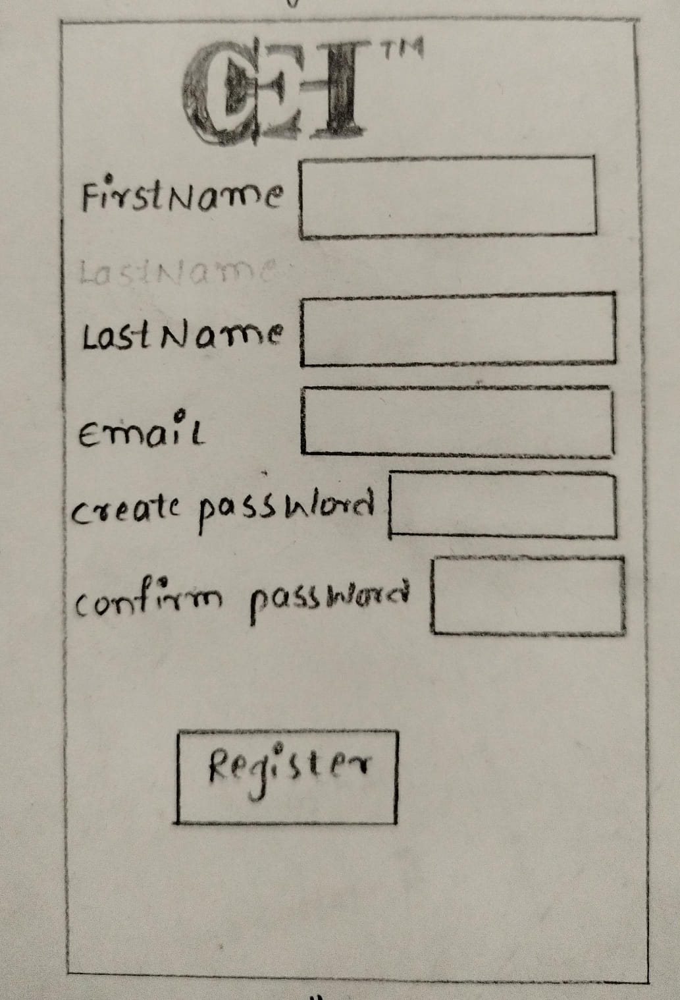
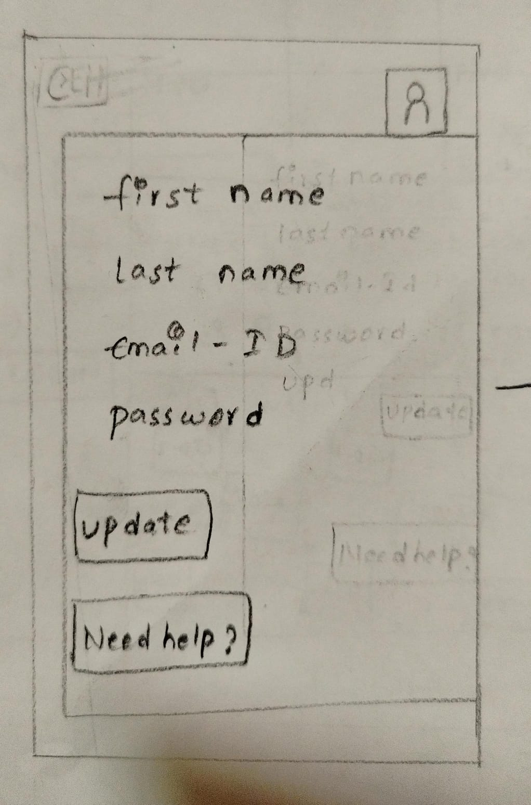
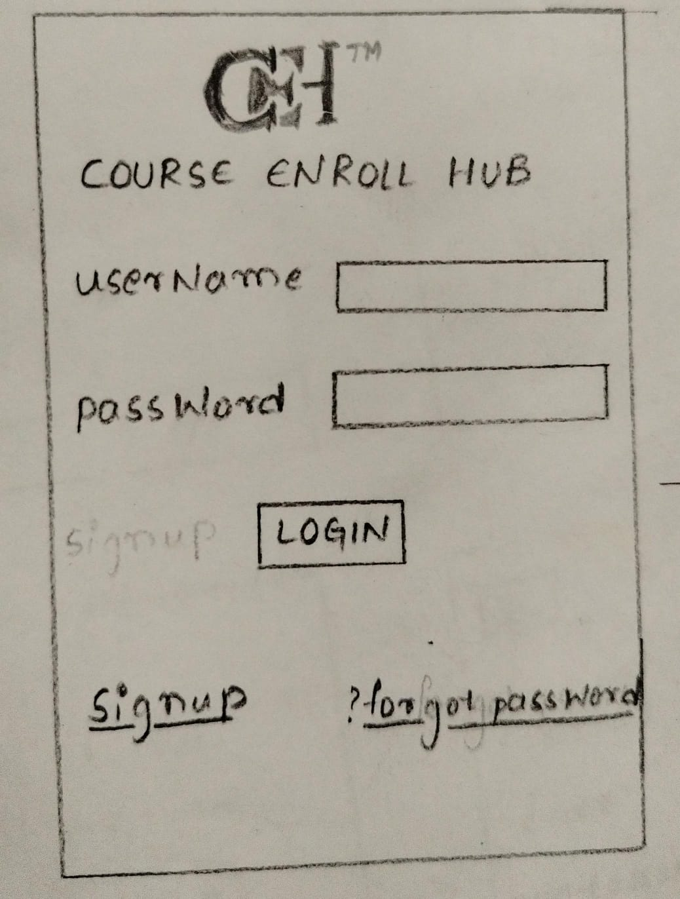
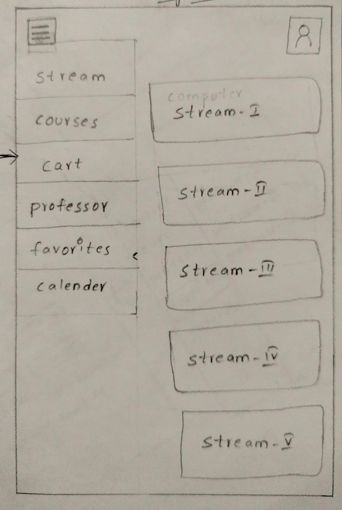
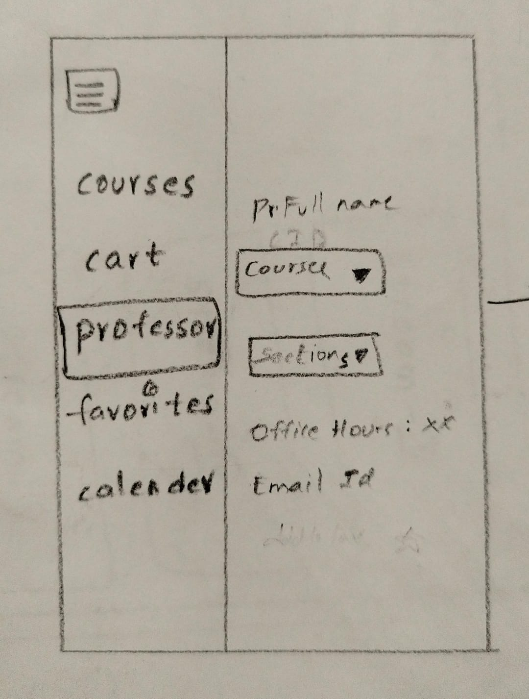
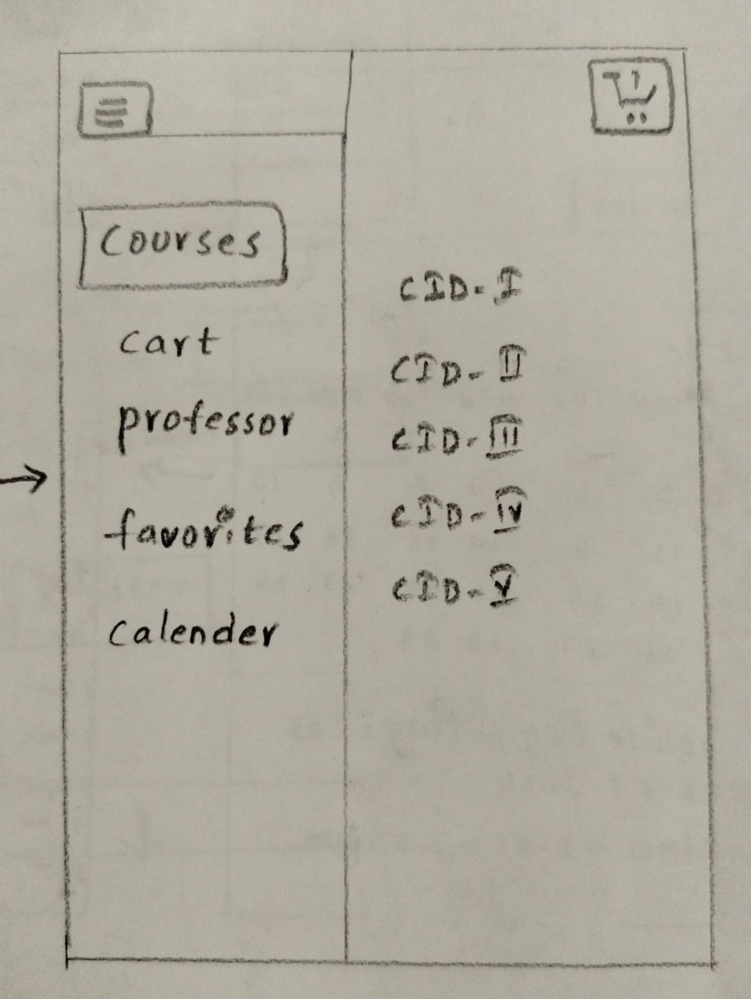
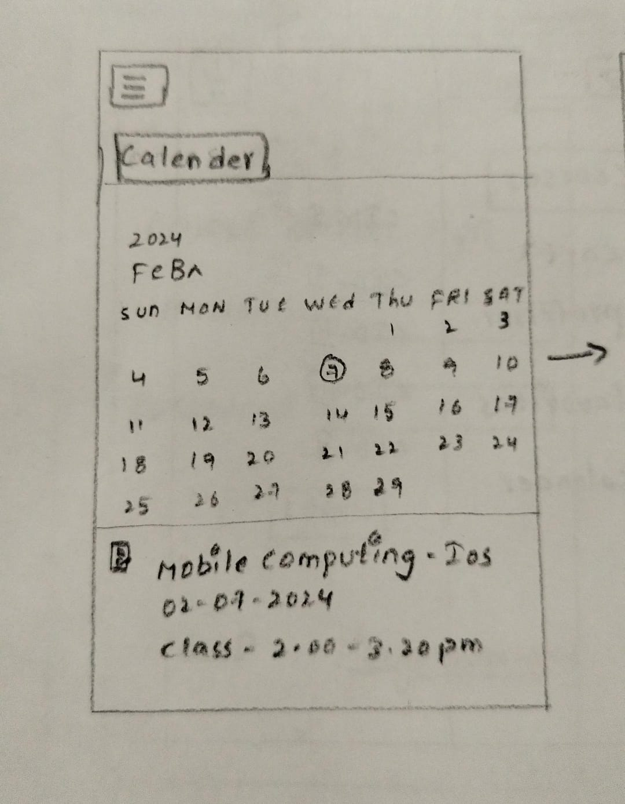
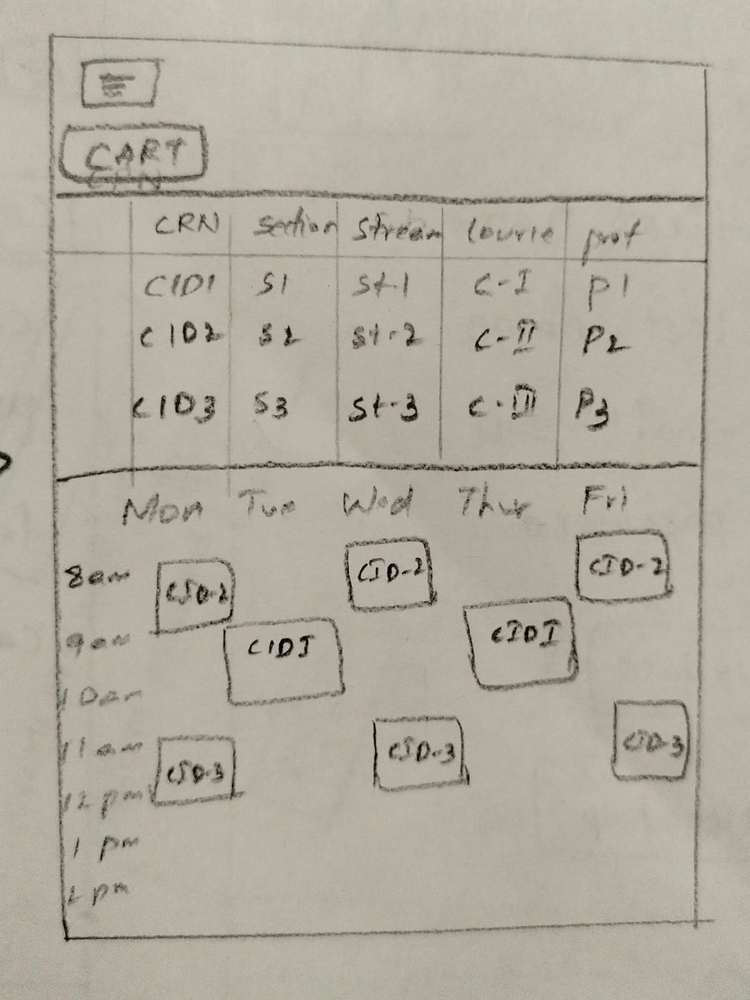
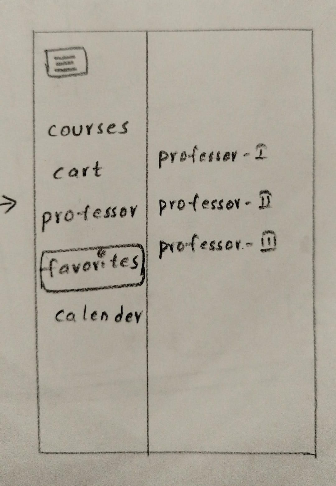

# Course-Enroll Hub App

Course-Enroll Hub is a user-friendly iOS application designed for efficient student class registration. The app employs Swift for seamless functionality and prioritizes security through a robust authentication system. Its straightforward interface includes modules for Classes, Courses, Calendar, and Cart, allowing students to easily navigate and register for classes. The app's simplicity is complemented by detailed class views, including sections, professors, and timings. 

With a focus on performance optimization and adherence to best practices, Course-Enroll Hub aims to provide a secure and swift class registration experience for students, enhancing their academic journey.

Roles& Responsibilities: 
Agraja Gottipati            -    Deployment and DB Management Expert 
Varshitha Nalluri            -    Module Designer and Testing Specialist 
Teja Kumar Muppala                    -    UI/UX Design Lead 
Khalida Parveen                -    Quality Assurance and Documentation specialist  

**Sprint 02**
This week we have finalized the project and started building UI Prototypes. Need to build database for the login page and for the project for the upcoming couple of weeks.

**Sprint 03**
In this Sprint we have contributed some useful commits to the project regarding login page:-

Teja Kumar Muppala: 
Commit-1: 
Created 3 UI Screens and implemented navigation among them. 
Commit-2: 
Added text fields Email and Password for login and Create Account screens. 
Commit-3: 
Added background colors for all 3 UI Screens.  

Agraja Gottipati: 
Commit-1: 
Added firebase authentication packages to working directory. 
Commit-2: 
Created a home and added segue among home page and signup/signin screens. 
Commit-3: 
Defined functionalities and segue identifiers to navigate among login/signup screens and home screen. 

Varshitha Nalluri: 
Commit-1: 
Created loginVC and Added connections to login page. 
Commit-2: 
Created createAccountVC class and added connections and outlets. 
Commit-3: 
Implemented functionality for create account and login methods. 
Commit-4: 
Disabled 'let go' and 'create an account' buttons initially. 

Khalida Parveen:  
Commit-1: 
Added image view and Home Screen UI elements. 
Commit-2: 
Added new segue to navigate from signup screen to login screen. 
Commit-3: 
Modified ‘create an AccountVC to override “goTo” segue with “jumpTo“. 

**Sprint-4**
In this Sprint we have contributed some useful commits to the project regarding login page:-

Teja Kumar Muppala:

Teja Kumar Muppala: Commit-1: Added Secure text and constraints for the login screen.

Commit-2: Added forgot password and auto layout in login screen.

Commit-3: Added confirm password and done auto layout for create account screen

Agraja Gottipati:

Commit-1: Created DashboardVC and added custom Table view as per requirement.

Commit-2: Added TableViewDataSource and TableViewDelegate to DashboardVC.

Commit-3: applied auto-layout to the login and register screens.

Varshitha Nalluri:

Commit-1: Created custom array(modules) for DashBoardTableView

Commit-2: Added logo in assests and done with auto layout in table view.

Commit-3: added image views in story board and created outlets in createAccountVC and LoginVC

Khalida Parveen:

Commit-1:

Commit-2: Updated ReadMe

Commit-3:

**Sprint 05**
In this Sprint we have contributed some useful commits to the project regarding forgot password and Courses page:-

Teja Kumar Muppala: 
Commit-1: 
Changed VC’s and App Delegates. 
Commit-2: 
Created Segue and Collection View for Courses. 
Commit-3: 
Changed Create Account code.  

Agraja Gottipati: 
Commit-1: 
Added constraints to all the UI elements of Login screen. 
Commit-2: 
created splashvc and added entrypoint for application. 
Commit-3: 
Applied auto layout for ForgotPasswordVC and Implemented logic for cancel and segue functionalities. 

Varshitha Nalluri: 
Commit-1: 
Added Constraints to both text fields of create Account View. 
Commit-2: 
Added splash view. 
Commit-3: 
Added a ForgotPasswordVC and created a view with required UI elements. 

Khalida Parveen:  
Commit-1: 
Modified data for login page 
Commit-2: 
Made changes in CreateAccountVC. 
Commit-3: 
Made Changes in DashboardVC. 

**Sprint 06**
In this Sprint we have contributed some useful commits to the project regarding view controller pages and created viewcourse detailVC and course register detailVC:-

Teja Kumar Muppala: 
Commit-1: 
Created table view controlled and worked on that for course selections 
Commit-2: 
Changed the app from split view to navigation 
Commit-3: 
Worked on the sections for the courses 

Agraja Gottipati: 
Commit-1: 
Added CourseRegisterDetailVC and created required connections 
Commit-2: 
Created new View CourseDetailVC 
Commit-3: 
Added EnrollCourseScene for Selected course registration 

Varshitha Nalluri: 
Commit-1: 
Added Another Screen for Cart 
Commit-2: 
Backtracked the working repository to fix bugs and packag… 
Commit-3: 
Created CourseRegisterVC scene and Outlets for that scene 

Khalida Parveen:  
Commit-1: 
Made changes in ForgotPasswordViewController 
Commit-2: 
Made changes in LoginVC and SplashViewController 
Commit-3: 
Made changes in CourseRegisterViewController 

